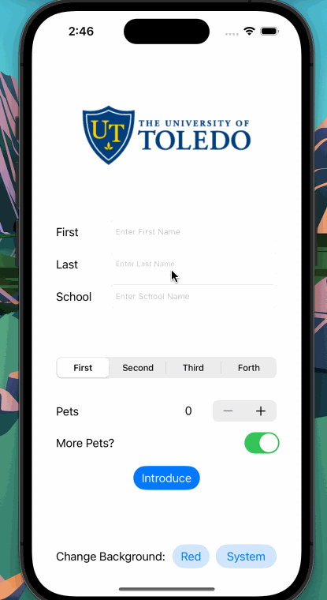

## Introduce Self

### App Description
Introduce Self is an IOS Application where a user can input their first name, last name, school name, school year, number of pet, more pet switch and display these info as a user information.

### App Walk-though

 

### Required Features

- [X] 1. App displays an image of a school's logo
- [X] 2. App has three textfields for first, last, and school names
- [X] 3. App has a segmented control that changes student year
- [X] 4. Number of pet matches label is increased/decreased by stepper
- [X] 5. Switch makes a statement about wanting more pets or not(true/false) 
- [X] 6. Introduce yourself button shows alert box with an introduciton and dismiss button

### Optional Features

- [X] 1. User can tap a button to change the color of the background view between red and a default system view (both in light and dark mode)
- [X] 2. Rounded buttons and better UI Design
- [ ] 2. User can select on additional buttons that provide more info about the user. Example: more textfields, a different alert box, etc.
